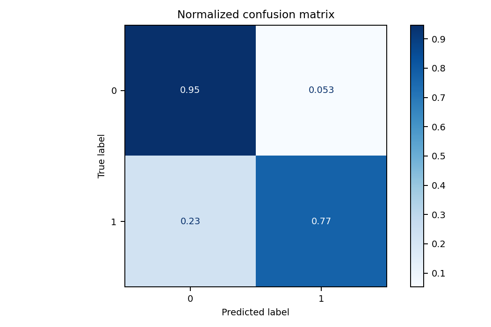
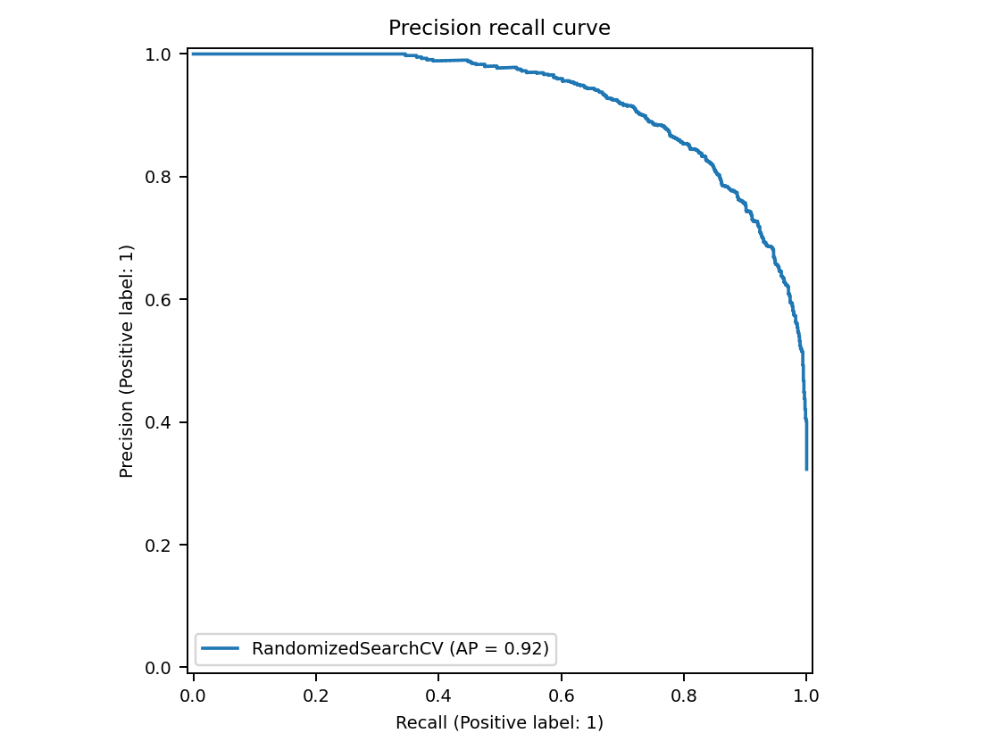
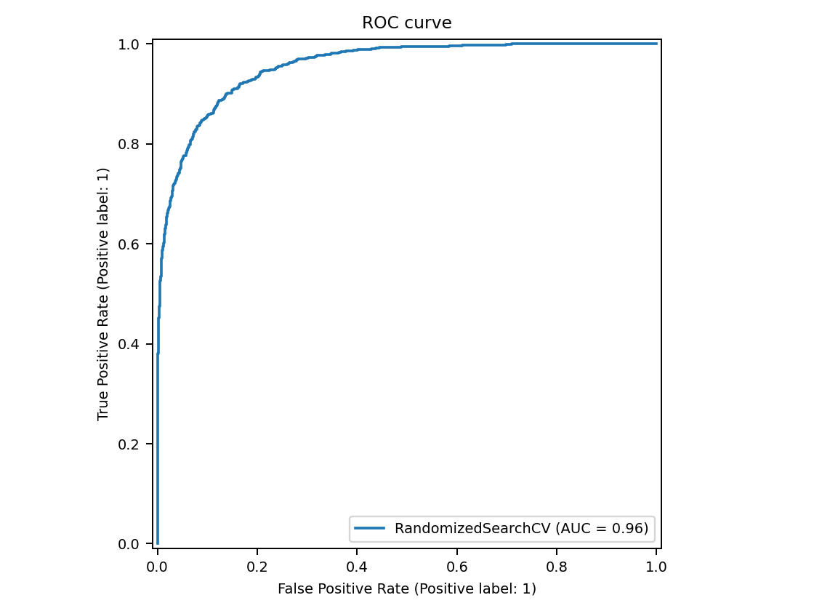

# Machine Learning - Predição de Churn no Telecom com modelos supervisionados e não supervisionados
_Este projeto consiste no trabalho final de Machine Learning II da trilha de Data Science do Programa Santander Coders 2024.1._ 

* **Módulo:** Machine Learning II
* **Instrutor:** Prof. Rogério Mainardes
* **Grupo**: 
    - Gabriel Marques ([GitHub](https://github.com/marqsleal) / [LinkedIn](https://www.linkedin.com/in/marqsleal/)); 
    - Maria Paula Andrade ([GitHub](https://github.com/MariaPaulaAndrade) / [LinkedIn](https://www.linkedin.com/in/maria-paula-andrade/)); 

## Instalação 

1. Clone o repositório:

```bash
git clone https://github.com/marqsleal/ml2-projeto-final
```

## Dependências 

Para instalar as dependências do projeto, execute:

```bash
pip install -r requirements.txt
```

## Estrutura do projeto 

```bash

```

## [Dataset publico predição de Churn por clientes de Telecom disponibilizado pela Maven Analytics](https://www.kaggle.com/datasets/shilongzhuang/telecom-customer-churn-by-maven-analytics)

O dataset "Telecom Customer Churn" foi obtido do Kaggle e é disponibilizado pela Maven Analytics. Ele contém informações relacionadas ao comportamento de clientes de uma operadora de telecomunicações, com o objetivo de prever a taxa de churn (cancelamento de serviços). O objetivo principal deste dataset é analisar padrões de comportamento de clientes e desenvolver modelos de machine learning para prever quais clientes têm maior probabilidade de cancelar o serviço.

## Abordagem Supervisionada
Para abordagem supervisionada, foram testados os modelos SVM, XGBoost, GradientBoost e AdaBoost, fazendo a validação cruzada com Random Search, integrando à esteira do MLFlow.

O modelo escolhido foi um GradientBoost, devido ao balanço entre o F1-score e Recall, uma vez que focamos no Recall como principal métrica pois mede a proporção de clientes que realmente vão churnar e foram corretamente identificados pelo modelo. Um Recall mais alto é preferível, pois garante que mais churns reais sejam detectados. O F1-score também é uma métrica importante pois é uma média harmônica entre precisão e recall. Ele é útil quando existe um desequilíbrio entre as classes.  

**Modelo**: GradientBoost RandSearch (ID: 36a7f63dcdd94369933a46cff0c0a03b).  
**Melhores hiper-parâmetros**: 'subsample': 0.8, 'n_estimators': 100, 'min_samples_split': 5, 'min_samples_leaf': 4, 'max_depth': 3, 'learning_rate': 0.1.  







## Abordagem Não Supervisionada